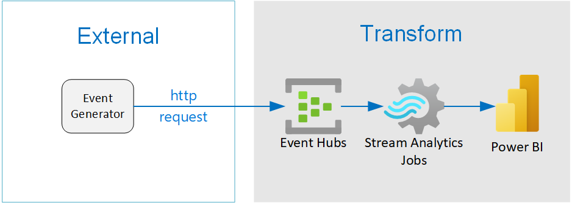

Streaming Analtyics Demo 
========================

This project demonstrates how to query streaming data using several Azure technologies:

- Azure Streaming Analtyics
- Azure Eventhubs

Workflow:

- Generator App sents message to Eventhubs
- Streaming analytics queries device message for failing devices

|architecture-overview|

Setup
=====
This setup will deploy the core infrastructure needed to run the the solution:

- Core infrastructure
- Generator App

Core Infrastructure
-------------------

Configure the global variables

.. code-block:: bash

    # Global
    RG_NAME=sa_demo
    RG_REGION=westus
    STORAGE_ACCOUNT_NAME=sa_demo
    
    #Event Hubs
    EH_NAMESPACE=sa_demo_ehn
    EH_NAME=sa_demo_eh

    #Streaming Analytics
    SA_NAME=sa_demo_sa

    # Existing Resources
    ACR_REGISTRY_NAME = <existing-registry-name>
    SERVICE_PRINCIPAL_ID = <existing-service-principal-id>
    SERVICE_PRINCIPAL_PASSWORD = <existing-service-principal-password>

**Resource Group**

Create a resource group for this project

.. code-block:: bash

    az group create --name $RG_NAME --location $RG_REGION

**Evenhubs**

.. code-block:: bash

    # Create an Event Hubs namespace. Specify a name for the Event Hubs namespace.
    az eventhubs namespace create --name $EH_NAMESPACE --resource-group $RG_NAME -l $RG_REGION   

    # Create an event hub. Specify a name for the event hub. 
    az eventhubs eventhub create --name $EH_NAME --resource-group $RG_NAME --namespace-name $EH_NAMESPACE

    # Create Read Policy and Connection string
    #TBD 

**Streaming Analytics**

.. code-block:: bash

    # Create a Job
    az stream-analytics job create --resource-group $RG_NAME 
    --name $SA_NAME --location $RG_REGION  --output-error-policy "Drop" --events-outoforder-policy "Drop" --events-outoforder-max-delay 5 --events-late-arrival-max-delay 16 --data-locale "en-US"

Generator
---------

The generator is a python application that runs in a docker container. The container expects the following environment variables stored in a ``local.env`` file.

Run generator in docker

.. code-block:: bash

    # Build and run image
    > docker build --pull --rm -f "dockerfile" -t streaminganaltyicsdemo:latest "."
    > docker run --rm -it --env-file local.env streaminganaltyicsdemo:latest

    #Run app
    > python main.py --template_path /path/to/templates/

Development
===========

Setup your dev environment by creating a virtual environment

.. code-block:: bash

    # virtualenv \path\to\.venv -p path\to\specific_version_python.exe
    python -m venv .venv.
    .venv\scripts\activate

    deactivate

